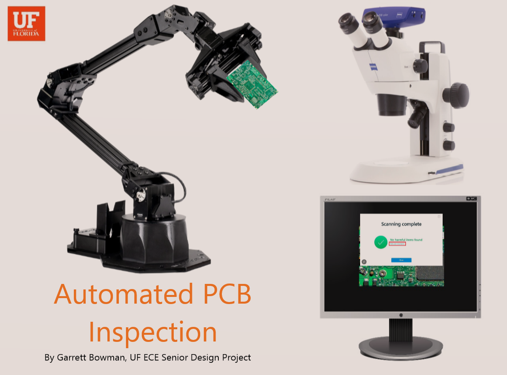

<!-- PROJECT LOGO -->
 

  

  <h3 align="center"> AutomatedPCBInspection</h3>

  

    Garrett Bowman's Senior Design Project
     
     
    <a href="#performance-and-results">View Demonstration</a>
     
  

 

<!-- TABLE OF CONTENTS -->

  
Table of Contents

  <ol>
    <li><a href="#about-the-project">About The Project</a></li>
    <li><a href="#dependencies">Dependencies</a></li>
    <li><a href="#setup-and-usage">Setup and Usage</a></li>
    <li><a href="#Demonstration">Demonstration</a></li>
    <li><a href="#authors">Authors</a></li>
    <li><a href="#acknowledgements">Acknowledgements</a></li>
    <li><a href="#thank-you">Thank You</a></li>
  </ol>

<!-- ABOUT THE PROJECT -->
## About The Project
Ensure hardware security, reduce costs and save time.

A prototype.
 

<!--

    DFgdfgwlkjgowdfglwfdg
    

-->

<!-- (more information and explanation may be added here) -->
 

<!-- Dependencies -->
## Dependencies

<!--   -->
ROS2 Galactic - May work with other ROS2 versions.

 
<!--  -->
I followed instructions specifically for Trossen X-series Robotic Arms products on Ubuntu 20.04. https://www.trossenrobotics.com/docs/interbotix_xsarms/ros_interface/software_setup.html

 
 
 

Leica Application Suite X 

 
<!--  Realsense D405 Depth Camera or similar  -->
Chrome Remote Desktop or something similar

 
  
<!--   -->

 

<!-- Setup and Usage -->

## Setup and Usage

***This is assuming you are using Trossen ROS2 Installation***

First, clone the repo

AutomatedPCBInspection.git

Open 2 terminals on linux system

Always “source  ~/interbotix_ws/install/setup.bash” in terminal before performing any commands or add it to to the end of your ~/.bashrc file.

In one terminal open XSARM Control module with RVIZ

"ros2 launch interbotix_xsarm_control xsarm_control.launch.py robot_model:=vx300”

In other terminal, navigate to AutomatedPCBInspection folder, run the main python script 

"python3 main.py"

You then need to use Chrome remote desktop or similar program to control linux computer from computer running LASX.

The AHK script I created is specifically for my workstation; It will need to be adjusted.

I reccommend using AHK window spy included in the dashboard for retriving colors, cursor positions, etc.

To make changes to robotic script, I would reccommend subscribing to joint states topic, adjusting arm to where you want using control panel (enabling/disabling torque for each joint).

There might be a better way to do this using perception/point clouds but I prefered serial movement to avoid damaging expensive equipment.

<!-- Performance and Results -->
## Performance and Results

Video Demonstration:

 

   

https://www.youtube.com/watch?v=ZAKIZniiHFI

<!-- Authors -->
## Authors

* Garrett Bowman, UF ECE - garrettbowman@ufl.edu

Project Link: [https://github.com/garrettbowman/AutomatedPCBInspection.git](https://github.com/garrettbowman/AutomatedPCBInspection.git)

<!-- ACKNOWLEDGEMENTS -->
## Acknowledgements

* [Dr. Navid Asadi](https://faculty.eng.ufl.edu/catia-silva/) - Faculty Advisor
* [Patrick Craig](https://faculty.eng.ufl.edu/catia-silva/) - Mentor
* [Catia Silva](https://faculty.eng.ufl.edu/catia-silva/) - Created readme template

## Thank you

If you made it this far, thank you for reading!

 
This README was proudly written 100% with nano :)

